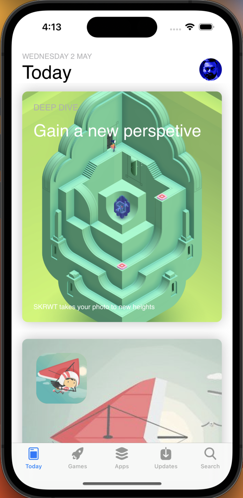
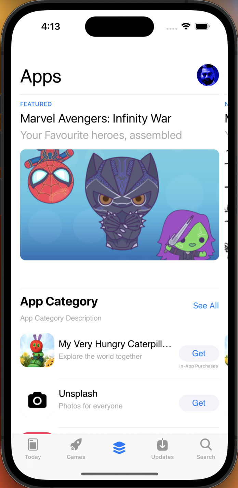
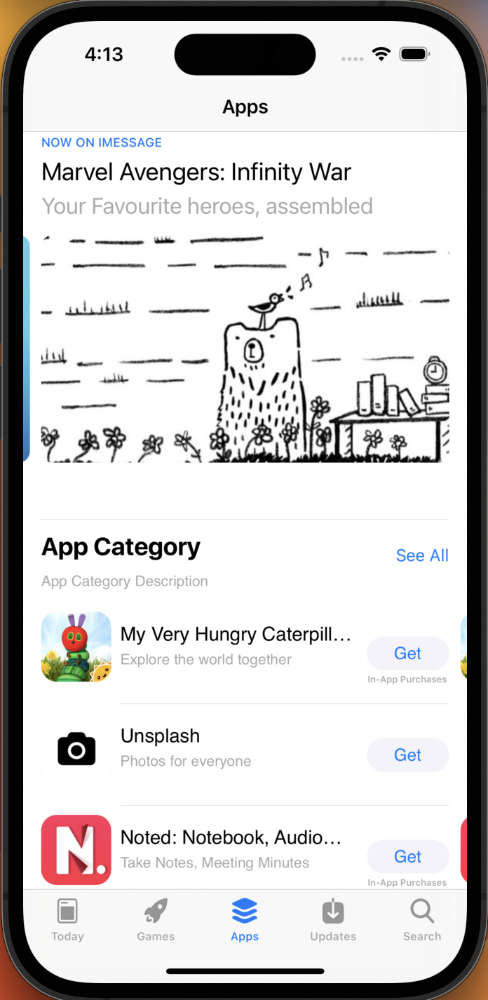

# Iphone App Store Prototype App

Welcome to the Iphone App Store Prototype App, an iOS application that depict the basic design of app store which includes bottom tab bar and two tabs design. This README file provides an overview of the app, its features, and the skills showcased in its development.

## Screenshots

  
  
  

## MVC Architecture

The **Iphone App Store Prototype** follows the Model-View-Controller (MVC) architectural pattern, which separates the application into three interconnected components:

- **Model**: Represents the data and business logic of the application.
- **View**: Displays the user interface and receives user inputs.
- **Controller**: Acts as an intermediary between the Model and the View, handling user inputs and updating the Model accordingly.

## UIKit Framework

The **Iphone App Store Prototype** is built using Apple's UIKit framework, which provides a comprehensive set of tools for building user interfaces across all Apple platforms.

## Collection View

The project utilizes the Collection View component to efficiently display and manage collections of items in various layouts. This enables the creation of dynamic and interactive interfaces for showcasing images, products, or any type of data.

## Table View

Table View is employed in the project to present structured data in a tabular format with rows and sections. It offers a standardized way to organize and display information, making it suitable for lists of contacts, messages, and more.

## Diffable Data Source

The Diffable Data Source is used in conjunction with Collection Views and Table Views to provide efficient and automatic updates to the UI based on changes in the underlying data. This makes managing complex data sets and maintaining a responsive user interface much simpler.

## XIBs

The project leverages XIB files for interface design. XIBs allow for creating individual interface components or views, supporting a modular approach to UI design. By utilizing XIBs, the project maintains a separation of concerns and enhances the reusability of UI elements.

## Requirements

- iOS 13.0+
- Xcode 13.0+
- Swift 5.5+

## How to Run

1. Clone the repository or download the ZIP file.
2. Open the `Iphone App Store Prototype.xcodeproj` file in Xcode.
3. Choose the desired simulator or a connected iOS device.
4. Press the "Run" button (or use the shortcut `Cmd + R`) to build and run the app.

## Contributing

Contributions to the Iphone App Store Prototype App are welcome! If you find any bugs, have feature suggestions, or want to contribute improvements, please feel free to open a pull request.

## Credits

The Iphone App Store Prototype.xcodeproj App is developed by **Sham Kumar**. If you have any questions or need assistance, you can reach out to me at ksham1999@gmail.com.

## License

The Iphone App Store Prototype.xcodeproj App is released under the [MIT License](LICENSE). You are free to use, modify, and distribute the app as per the terms of the license.
